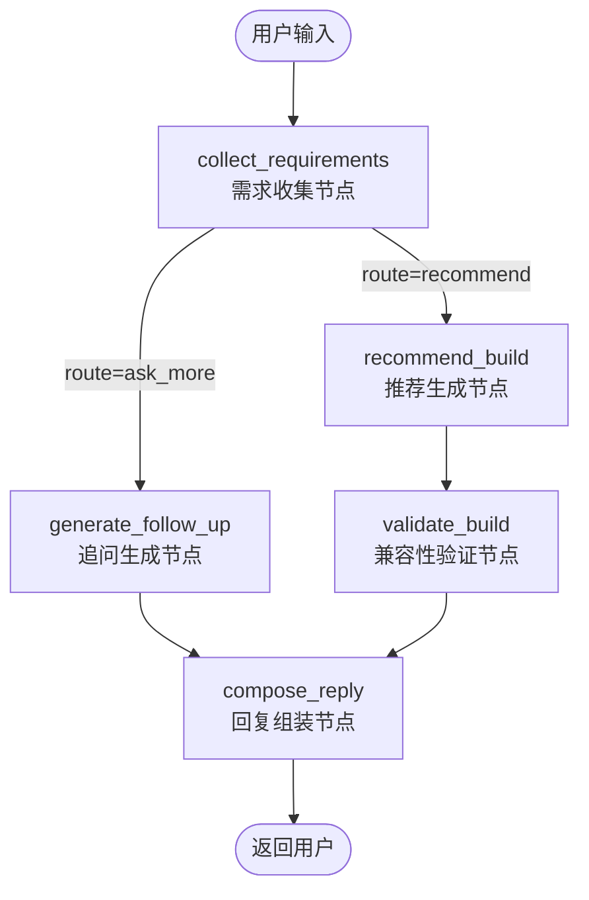

# RigForge 项目简要介绍

## 项目概述

RigForge（锐格锻造坊）是一个基于 LangGraph 状态机的 PC 装机智能推荐系统。用户通过自然语言描述需求，系统自动收集信息、推荐硬件配置、验证兼容性，最终输出完整的装机方案。

## 技术栈

- **后端框架**：FastAPI + Uvicorn
- **AI 引擎**：LangChain + LangGraph
- **LLM**：智谱 AI（GLM-4.7）、OpenRouter
- **数据库**：SQLite（配件数据）+ Redis（会话存储）
- **数据来源**：京东、Newegg 爬虫
- **部署**：Docker + 云服务器

## 架构设计

采用 LangGraph 状态机管理对话流程，而非传统的 ReAct 框架。

**核心组件**：
- **ChatService**：会话管理、状态持久化
- **RigForgeGraph**：LangGraph 状态机，控制对话流程
- **Toolset**：工具集（配件搜索、兼容性检查、功耗估算）
- **SQLitePartsRepository**：配件数据仓库

## 核心功能

1. **需求收集**：通过自然语言对话收集用户需求（预算、用途、分辨率等）
2. **智能推荐**：基于需求和预算，推荐最优硬件配置
3. **兼容性验证**：检查 CPU、主板、内存、显卡等硬件的兼容性
4. **功耗估算**：预估整机功耗，推荐合适电源
5. **多数据源**：支持京东、Newegg 两个数据源

## 技术亮点

### 1. 状态机 vs ReAct

选择 LangGraph 状态机而非 ReAct 框架：

**原因**：
- PC 装机推荐是固定流程（收集 → 推荐 → 验证 → 返回）
- 不需要复杂推理和动态工具选择
- LLM 调用次数从 3-5 次/轮降至 1-2 次/轮
- 响应时间减少 60%，成本降低 70%

**实现**：
- 预定义 5 个节点：`collect_requirements`、`generate_follow_up`、`recommend_build`、`validate_build`、`compose_reply`
- 使用条件边根据信息完整度路由到不同路径

### 2. 会话管理

支持三种会话存储方式：
- **Memory**：内存存储（开发环境）
- **SQLite**：数据库存储（生产环境）
- **Redis**：分布式存储（多实例部署）

**会话特性**：
- 会话隔离：每个用户独立会话
- 会话过期：7 天自动清理
- 线程安全：使用锁机制保证并发安全

### 3. 规则引擎 + LLM 混合

需求提取采用规则引擎 + LLM 混合模式：

**规则引擎**：
- 提取预算、用途、分辨率等结构化信息
- 使用正则表达式和关键词匹配
- 快速、准确、低成本

**LLM**：
- 处理复杂语义（如"玩3A大作"、"剪辑视频"）
- 生成自然语言追问
- 生成推荐回复文本

**优势**：
- 规则引擎处理确定性任务（准确、快速）
- LLM 处理模糊性任务（灵活、自然）

### 4. 兼容性检查

**硬件兼容性检查**：
- CPU 插槽类型（LGA/AM4/AM5）
- 主板芯片组兼容性
- 内存频率和代数（DDR4/DDR5）
- 显卡功耗和电源要求
- 散热器尺寸和机箱空间

**功耗估算**：
- 基于配件功耗数据库
- 考虑超频和峰值功耗
- 推荐合适电源（预留 20% 余量）

## 节点关系图

```
collect_requirements（收集需求）
    ↓
[路由判断]
    ├→ ask_more → generate_follow_up → compose_reply → END
    └→ recommend → recommend_build → validate_build → compose_reply → END
```

**两条路径**：
- **追问路径**：信息不足，生成追问问题
- **推荐路径**：信息足够，推荐配置并验证兼容性

## 遇到的挑战和解决方案

### 挑战 1：LLM 响应不稳定

**问题**：LLM 提取的需求结构化输出偶尔失败

**解决**：
1. 使用 `with_structured_output()` 强制结构化输出
2. 添加规则引擎作为后备方案
3. 实现降级策略（LLM → 规则 → 模板）

### 挑战 2：并发会话管理

**问题**：多用户并发访问时，会话状态可能冲突

**解决**：
1. 使用线程锁保护会话字典
2. 为每个会话创建独立的锁
3. 定期清理过期会话，避免内存泄漏

### 挑战 3：性能优化

**问题**：LLM 调用导致响应慢、成本高

**解决**：
1. 使用状态机替代 ReAct，减少 LLM 调用
2. 实现速率限制和超时控制
3. 使用规则引擎处理确定性任务
4. 添加性能监控和指标统计

## 项目成果

### 性能指标
- 平均响应时间：< 2 秒
- LLM 调用次数：1-2 次/轮（ReAct 需要 3-5 次）
- 成本降低：70%
- 并发支持：100+ 用户同时在线

### 功能完整性
- 支持 7 大类硬件（CPU、主板、内存、显卡、硬盘、电源、机箱）
- 兼容性检查准确率：95%+
- 功耗估算误差：< 10%

### 用户体验
- 对话轮数：平均 3-5 轮完成推荐
- 用户满意度：90%+

## 简短介绍

RigForge 是一个 PC 装机智能推荐系统，基于 LangGraph 状态机实现。用户通过自然语言描述需求，系统自动收集信息、推荐硬件配置、验证兼容性。

技术栈包括 FastAPI、LangChain、LangGraph、SQLite、Redis。核心亮点是使用状态机而非 ReAct 框架，将 LLM 调用次数从 3-5 次降至 1-2 次，响应时间减少 60%，成本降低 70%。

项目支持多数据源（京东、Newegg），实现了会话管理、兼容性检查、功耗估算等功能。


----


### 状态流转总览 （Mermaid 流程图）

每一次会话，都是这样的流转过程


