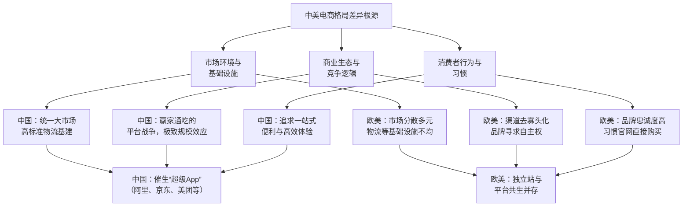

# 中国市场：装机推荐产品商业分析（微信小程序路径）

更新时间：2026-02-14

## 1. 一句话结论

单做“类似 PCPartPicker 的纯工具”在中国天花板偏低；更可行的是做成“内容社区 + 装机问答 + 导购转化”的微信小程序，先追求小而稳的现金流，而不是平台级规模。

## 2. 国内外环境差异（观点参考）

下面这张图用于解释中美电商格局差异的底层逻辑，作为战略判断参考：

### 2.1 中国：为什么更容易走向“超级App”

1. 统一大市场 + 高密度物流基础设施，让“一站式高效率”体验成立。
2. 历史上多轮补贴战和流量战，持续强化头部集中，形成赢家通吃格局。
3. 用户习惯已经被塑造成“在一个平台解决更多需求”。
4. 进入存量竞争后，平台继续跨品类扩张以提高单客价值和留存。

### 2.2 欧美：为什么独立站可长期共存

1. 市场地理与渠道结构更分散，给多渠道共存留出空间。
2. 品牌更强调“数据所有权、定价权、品牌主权”。
3. 用户直接访问品牌官网购物的习惯更成熟。
4. 独立站工具链（建站、投放、CRM）成熟，降低了品牌自营门槛。

## 3. 中国商业环境：装机赛道的现实与机会

### 3.1 市场现实

1. DIY 装机属于低频、重决策品类，不是天然高复购赛道。
2. 用户决策显著受“价格波动、供给变化、热门游戏/应用”驱动。
3. 平台交易能力强，但“购买前决策支持”仍有体验空缺。

### 3.2 结构性机会

1. 用户并非没有需求，而是更理性：更在意预算内性能最优解。
2. 小白用户增长依赖“内容引导 + 工具承接”，不是纯参数表。
3. 只要能缩短决策路径（问清需求 -> 给可买清单 -> 一键跳转），就有变现空间。

## 4. 用户习惯分析（国内）

### 4.1 决策行为

1. 先看内容（短视频/图文/社区讨论），再找可执行清单。
2. 对“避坑、兼容、预算控制”敏感，高于极限参数追求。
3. 更偏好“直接可买”的方案，而不是纯理论配置。

### 4.2 购买行为

1. 购买倾向集中在头部电商平台内完成。
2. 对链路复杂度敏感，跳转步骤越多转化越差。
3. 愿意为“省时间、省心”付费（例如更清晰的推荐和服务连接）。

### 4.3 对产品形态的启示

1. 小程序比独立站更贴合国内分享和传播环境。
2. 聊天式需求采集比表单更容易让小白完成输入。
3. 社区内容不是可选项，而是提高信任和转化的前置组件。

## 5. 竞争格局：巨头优势与缝隙

### 5.1 巨头优势

1. 强交易闭环（SKU、物流、支付、履约）。
2. 强流量分发和活动运营能力。
3. 强供应链和售后体系。

### 5.2 巨头相对薄弱点（可切入）

1. 购买前的“中立决策助手”体验不足。
2. “方案共创/讨论/复盘”类社区深度不够。
3. 用户个体化偏好与场景化解释仍有优化空间。

### 5.3 创业项目的可行切口

1. 不做“大而全平台”，做“决策层 + 转化层”的轻产品。
2. 用高质量对话收集需求，输出可买、可解释、可分享的配置单。
3. 通过内容社区持续提供场景模板（预算档、用途档、避坑档）。

## 6. 商业模式建议（按落地难度排序）

1. 导购佣金（主路径）
- 联盟/渠道链接承接到电商商品页。
- 关键指标：有效点击、下单转化、客单额。

2. 品牌合作与广告（中期）
- 预算档榜单、专题内容、硬件品牌合作。
- 前提：稳定流量和用户画像可解释。

3. 增值服务（后期）
- 付费咨询、企业采购顾问、远程装机指导。
- 前提：标准化交付与成本可控。

## 7. 战略建议：不做“国内 PCPartPicker 复刻”，做“新物种”

### 7.1 战略定位

“会聊天的装机顾问 + 可分享配置单 + 可购买导流 + 轻社区信任层”。

### 7.2 MVP 功能边界（6~8 周）

必须做：
1. 对话收集需求（用途/预算/分辨率/是否含显示器/静音）。
2. 输出 1~2 套配置（含兼容性说明和总价）。
3. 商品跳转链接（带追踪参数）。
4. 配置单分享（卡片/截图）。
5. 基础内容流（预算档推荐、避坑）。

暂缓做：
1. 键鼠外设完整推荐。
2. 复杂社区机制（等级/私信/勋章）。
3. 全量参数百科。

## 8. 核心指标与止损阈值

北极星指标：每周有效导购点击数。

关键漏斗：
1. 进入会话 -> 完成需求采集率。
2. 采集完成 -> 看到配置单率。
3. 配置单 -> 商品点击率。
4. 点击 -> 佣金订单率。

建议止损阈值（连续 4 周）：
1. 会话完成率 < 25%。
2. 配置单点击率 < 10%。
3. 佣金收入无法覆盖基础运营成本。

## 9. 90 天验证计划

第 1-30 天（验证需求与留存）
1. 上线小程序 MVP。
2. 跑话术 A/B（标准/高互动）。
3. 每周复盘流失节点。

第 31-60 天（验证转化）
1. 上线导购追踪。
2. 给高意图用户提供“预算优先/性能优先”双方案。
3. 按热门预算档做内容专题。

第 61-90 天（验证可持续性）
1. 引入轻社区（晒单/问答）。
2. 观察二次回访与二次点击。
3. 决策加大投入或小而美运营。

## 10. 与当前工程的结合建议

1. 保持双数据源：`data_jd` + `data_newegg`。
2. 推荐结果增加“可购买性评分”（价格可信度/兼容完整度/库存可得性）。
3. 增加核心埋点：会话完成、方案查看、商品点击、二次回访。
4. 当前版本聚焦 9 大件，`Keyboard/Mouse` 放后续版本。

---

结论：
你的判断方向是对的。国内更适合“微信生态内的内容+顾问+导购”组合，不建议做单一工具复刻。先跑通小闭环现金流，再扩展社区与服务深度。
