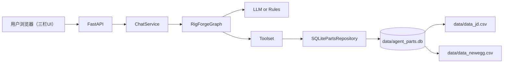

# RigForge（锐格锻造坊）系统方案与模块方案

## 1. 系统目标

1. 通过多轮对话采集装机需求。
2. 自动生成配置并做兼容性检查。
3. 大模型不可用时回退规则，保持可用。
4. 记录会话指标用于持续优化。

## 2. 总体架构

说明：服务启动时由两份 CSV 重建运行数据库，运行阶段只读该数据库。前端布局为左侧需求画像、中间聊天、右侧推荐与风险。

前端渲染说明：
1. 前端是原生 HTML/CSS/JavaScript 静态页面，不依赖 React/Vue 或 SSR 模板引擎。
2. `GET /` 由 FastAPI 直接返回 `frontend/index.html`。
3. `app.mount("/static", StaticFiles(directory=FRONTEND_DIR), name="static")` 提供 `frontend/styles.css` 与 `frontend/app.js`。
4. 页面交互由 `frontend/app.js` 负责，通过 `POST /api/chat` 拉取结果后更新 DOM，实现客户端渲染（CSR）。

## 3. 模块职责

1. `src/rigforge/main.py`
- 应用启动、路由注册、CSV 初始化建库。

2. `src/rigforge/csv_runtime_db.py`
- CSV -> `data/agent_parts.db` 的规范化与重建。

3. `src/rigforge/db.py`
- `SQLitePartsRepository` 读取运行件库。

4. `src/rigforge/graph.py`
- 对话编排、路由、回复生成。

5. `src/rigforge/tools.py`
- 选件、功耗估算、兼容检查。

6. `src/rigforge/service.py`
- 会话状态、指标落库、TTL 清理。

7. `frontend/`
- 聊天与配置展示。
- 三栏布局：需求画像 / 聊天窗口 / 推荐与风险。
- `index.html` 定义页面骨架，`styles.css` 负责样式，`app.js` 负责状态更新与 API 调用。

## 4. 关键流程

1. 服务启动：读取 `data/data_jd.csv` 与 `data/data_newegg.csv`。
2. 重建运行库：写入 `data/agent_parts.db`。
3. 对话请求：采集需求 -> 追问/推荐 -> 校验 -> 回复。
4. 指标与会话：持久化到 `data/metrics.db`。
5. 每轮返回都包含实时推荐预览，前端动态刷新配置卡片。

## 5. 配置项

1. 模型相关：`OPENROUTER_*` / `ZHIPU_*` / `OPENAI_*`
2. 超时与间隔：`LLM_TIMEOUT_SECONDS` 等
3. 会话存储：`SESSION_STORE`、`SESSION_TTL_SECONDS` 等

## 6. 迭代重点

1. 推荐质量评测与回放。
2. 兼容性规则覆盖率提升。
3. 对话策略与转化指标联动优化。
