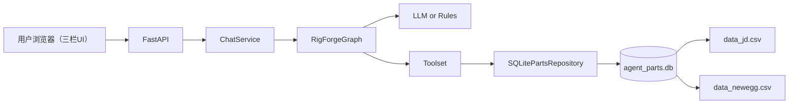

# RigForge（锐格锻造坊）系统架构说明书

## 1. 系统目标

1. 通过多轮对话采集装机需求
2. 自动生成配置并做兼容性检查
3. 大模型不可用时回退规则，保持可用
4. 记录会话指标用于持续优化

---

## 2. 总体架构



**架构说明**：
- 服务启动时由两份 CSV 重建运行数据库
- 运行阶段只读数据库
- 前端布局：左侧需求画像、中间聊天、右侧推荐与风险

**前端渲染**：
- 原生 HTML/CSS/JavaScript 静态页面
- `GET /` 返回 `frontend/index.html`
- 静态资源通过 `/static` 挂载
- 页面交互通过 `POST /api/chat` 实现 CSR

---

## 3. 目录结构

```
src/rigforge/
├── main.py              # FastAPI 入口
├── service.py           # 会话管理
├── graph.py             # 工作流编排
├── tools.py             # 工具函数
├── csv_runtime_db.py    # CSV 数据加载
├── db.py                # 数据库访问
├── schemas.py           # Pydantic 模型
│
├── llm/                 # LLM 模块
│   ├── __init__.py
│   ├── providers.py     # LLM 提供商构建
│   └── prompts.py       # Prompt 模板
│
├── nodes/               # 工作流节点
│   ├── __init__.py
│   ├── extract.py       # 需求提取节点
│   ├── follow_up.py     # 追问生成节点
│   ├── recommend.py     # 配置推荐节点
│   ├── validate.py      # 兼容性验证节点
│   └── compose.py       # 回复组装节点
│
├── builder/             # 配置生成
│   ├── __init__.py
│   ├── budget.py        # 预算分配
│   ├── picker.py        # 配件选择
│   └── compatibility.py # 兼容性检查
│
└── data/                # 数据层
    ├── __init__.py
    ├── models.py        # 数据模型
    └── repository.py    # 仓库接口
```

---

## 4. 模块职责

### 4.1 核心模块

| 模块 | 职责 |
|------|------|
| `main.py` | FastAPI 应用入口、路由注册、启动初始化 |
| `service.py` | 会话状态管理、指标落库、TTL 清理 |
| `graph.py` | LangGraph 工作流编排、节点协调 |
| `tools.py` | 配件搜索、功耗估算等工具函数 |
| `csv_runtime_db.py` | CSV 数据加载与数据库重建 |
| `db.py` | SQLite 数据库访问层 |
| `schemas.py` | Pydantic 数据模型定义 |

### 4.2 LLM 模块 (`llm/`)

| 文件 | 职责 |
|------|------|
| `providers.py` | LLM 提供商构建（智谱/OpenRouter/OpenAI） |
| `prompts.py` | Prompt 模板定义 |

### 4.3 节点模块 (`nodes/`)

| 文件 | 职责 |
|------|------|
| `extract.py` | 需求提取节点 - 解析用户输入，提取结构化需求 |
| `follow_up.py` | 追问生成节点 - 根据缺失字段生成追问 |
| `recommend.py` | 配置推荐节点 - 生成硬件配置方案 |
| `validate.py` | 兼容性验证节点 - 检查配置兼容性 |
| `compose.py` | 回复组装节点 - 生成最终用户回复 |

### 4.4 构建器模块 (`builder/`)

| 文件 | 职责 |
|------|------|
| `budget.py` | 预算分配策略 - 按用途分配各配件预算比例 |
| `picker.py` | 配件选择逻辑 - 从候选中选择最优组合 |
| `compatibility.py` | 兼容性检查规则 - CPU/主板/内存/机箱等 |

### 4.5 数据模块 (`data/`)

| 文件 | 职责 |
|------|------|
| `models.py` | 数据模型定义 - Part, UserRequirements, BuildPlan |
| `repository.py` | 数据仓库接口 - 配件查询与过滤 |

### 4.6 前端 (`frontend/`)

| 文件 | 职责 |
|------|------|
| `index.html` | 页面骨架 |
| `styles.css` | 样式定义 |
| `app.js` | 状态管理与 API 调用 |

---

## 5. 工作流架构

```
┌─────────────────────────────────────────────────────────────────────────────┐
│                         LangGraph 状态编排                                   │
├─────────────────────────────────────────────────────────────────────────────┤
│                                                                             │
│   ┌─────────────────────┐                                                   │
│   │ collect_requirements │ ◄── 入口节点                                     │
│   └──────────┬──────────┘                                                   │
│              │                                                              │
│      ┌───────┴───────┐                                                      │
│      │               │                                                      │
│      ▼               ▼                                                      │
│  ask_more        recommend                                                  │
│      │               │                                                      │
│      ▼               ▼                                                      │
│ ┌──────────┐   ┌──────────┐                                                 │
│ │follow_up │   │recommend │                                                 │
│ └────┬─────┘   │  _build  │                                                 │
│      │         └────┬─────┘                                                 │
│      │              │                                                       │
│      │              ▼                                                       │
│      │        ┌──────────┐                                                  │
│      │        │ validate │                                                  │
│      │        └────┬─────┘                                                  │
│      │             │                                                        │
│      └──────┬──────┘                                                        │
│             ▼                                                               │
│      ┌────────────┐                                                         │
│      │compose_reply│                                                        │
│      └─────┬──────┘                                                         │
│            ▼                                                                │
│           END                                                               │
│                                                                             │
└─────────────────────────────────────────────────────────────────────────────┘
```

详细流程见 [WORKFLOW_DIAGRAM.md](WORKFLOW_DIAGRAM.md)

---

## 6. 数据流

```
┌─────────────────────────────────────────────────────────────────────────────┐
│                              数据流向                                        │
├─────────────────────────────────────────────────────────────────────────────┤
│                                                                             │
│   CSV 文件                          运行时数据库                             │
│   ┌─────────────┐                  ┌─────────────┐                         │
│   │data_jd.csv  │                  │agent_parts.db│                        │
│   │data_newegg  │ ──启动时重建──▶  │  (SQLite)   │                         │
│   └─────────────┘                  └──────┬──────┘                         │
│                                           │                                │
│                                           ▼                                │
│                                    ┌─────────────┐                         │
│                                    │ Repository  │                         │
│                                    └──────┬──────┘                         │
│                                           │                                │
│                      ┌────────────────────┼────────────────────┐          │
│                      │                    │                    │          │
│                      ▼                    ▼                    ▼          │
│               ┌──────────┐         ┌──────────┐        ┌──────────┐      │
│               │search_cpu│         │search_gpu│        │search_...│      │
│               └──────────┘         └──────────┘        └──────────┘      │
│                      │                    │                    │          │
│                      └────────────────────┼────────────────────┘          │
│                                           ▼                                │
│                                    ┌─────────────┐                         │
│                                    │  BuildPlan  │                         │
│                                    └─────────────┘                         │
│                                                                             │
└─────────────────────────────────────────────────────────────────────────────┘
```

---

## 7. 配置项

### 7.1 模型配置

| 环境变量 | 说明 |
|---------|------|
| `ZHIPU_API_KEY` | 智谱 GLM API Key |
| `OPENROUTER_API_KEY` | OpenRouter API Key |
| `OPENAI_API_KEY` | OpenAI API Key |

### 7.2 服务配置

| 环境变量 | 默认值 | 说明 |
|---------|-------|------|
| `SESSION_STORE` | `sqlite` | 会话存储方式 |
| `SESSION_TTL_SECONDS` | `3600` | 会话超时时间 |
| `LLM_TIMEOUT_SECONDS` | `30` | LLM 调用超时 |
| `MODEL_PROVIDER` | `zhipu` | 默认模型提供商 |

---

## 8. 关键流程

| 阶段 | 说明 |
|------|------|
| 服务启动 | 读取 CSV → 重建 `agent_parts.db` → 初始化 FastAPI |
| 对话请求 | 采集需求 → 追问/推荐 → 校验 → 回复 |
| 会话管理 | SQLite 持久化 → TTL 自动清理 |
| 指标记录 | 每轮对话记录到 `metrics.db` |

---

## 9. 迭代重点

1. 推荐质量评测与回放
2. 兼容性规则覆盖率提升
3. 对话策略与转化指标联动优化
