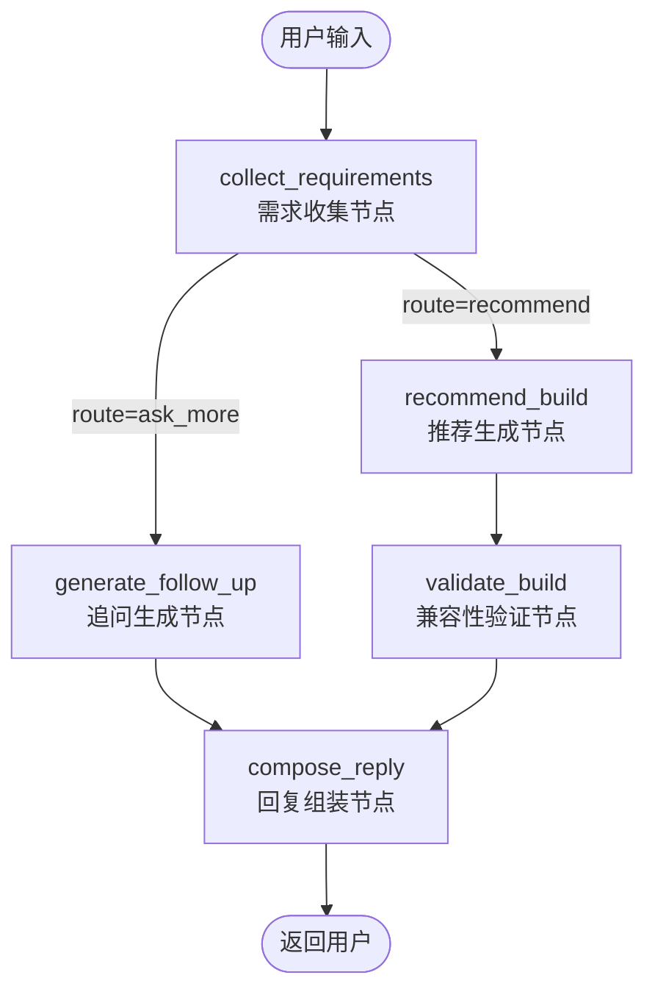

# RigForge 会话到推荐生成工作流详解

## 一、整体架构

```
┌─────────────────────────────────────────────────────────────────────────────┐
│                              用户请求入口                                     │
│                           POST /api/chat                                     │
└─────────────────────────────────────────────────────────────────────────────┘
                                      │
                                      ▼
┌─────────────────────────────────────────────────────────────────────────────┐
│                            ChatService (service.py)                          │
│  ┌─────────────┐  ┌─────────────┐  ┌─────────────┐                          │
│  │ 会话管理     │  │ 状态持久化   │  │ 指标统计    │                          │
│  └─────────────┘  └─────────────┘  └─────────────┘                          │
└─────────────────────────────────────────────────────────────────────────────┘
                                      │
                                      ▼
┌─────────────────────────────────────────────────────────────────────────────┐
│                          RigForgeGraph (graph.py)                            │
│                        LangGraph 状态编排引擎                                  │
└─────────────────────────────────────────────────────────────────────────────┘
```

---

## 二、节点关系与跳转条件

### 2.1 状态流转总览



### 2.2 节点连接关系表

| 起点 | 终点 | 连接类型 | 跳转条件 |
|------|------|----------|----------|
| START | collect_requirements | 固定边 | 每轮对话入口 |
| collect_requirements | generate_follow_up | 条件边 | `state["route"] == "ask_more"` |
| collect_requirements | recommend_build | 条件边 | `state["route"] == "recommend"` |
| generate_follow_up | compose_reply | 固定边 | 无条件 |
| recommend_build | validate_build | 固定边 | 无条件 |
| validate_build | compose_reply | 固定边 | 无条件 |
| compose_reply | END | 条件边 | `state["response_text"]` 存在 |

### 2.3 详细跳转条件说明

#### 条件边 1：collect_requirements → generate_follow_up / recommend_build

```
┌─────────────────────────────────────────────────────────────────────────────┐
│                      collect_requirements 路由决策                           │
├─────────────────────────────────────────────────────────────────────────────┤
│                                                                             │
│   路由函数: route_after_collection(state) → state["route"]                  │
│                                                                             │
│   ┌─────────────────────────────────────────────────────────────────────┐   │
│   │                     路由决策流程                                     │   │
│   ├─────────────────────────────────────────────────────────────────────┤   │
│   │                                                                     │   │
│   │   1. LLM 模式:                                                      │   │
│   │      llm_based_route = "recommend" if not should_continue else "ask_more" │
│   │                                                                     │   │
│   │   2. 规则模式:                                                       │   │
│   │      rule_based_route = _rule_based_route_decision(merged, user_input) │
│   │                                                                     │   │
│   │   3. 最终路由:                                                       │   │
│   │      route = llm_based_route  # LLM 判断优先                        │   │
│   │                                                                     │   │
│   └─────────────────────────────────────────────────────────────────────┘   │
│                                                                             │
│   ┌───────────────────────┐         ┌───────────────────────┐              │
│   │   route = "ask_more"  │         │  route = "recommend"  │              │
│   │                       │         │                       │              │
│   │   跳转 → generate_follow_up │   │   跳转 → recommend_build │            │
│   └───────────────────────┘         └───────────────────────┘              │
│                                                                             │
└─────────────────────────────────────────────────────────────────────────────┘
```

**ask_more 分支触发条件（任一满足）：**
- LLM 返回 `should_continue = true`
- 缺少关键信息（预算、用途、分辨率）
- 用户没有明确表示结束

**recommend 分支触发条件（任一满足）：**
- LLM 返回 `should_continue = false`
- 用户说"不用了"、"够了"、"开始推荐"、"随便"
- 已收集预算、用途、分辨率三个核心信息
- 对话轮数超过限制（默认 10 轮）

#### 条件边 2：compose_reply → END

```
┌─────────────────────────────────────────────────────────────────────────────┐
│                        compose_reply 结束条件                                │
├─────────────────────────────────────────────────────────────────────────────┤
│                                                                             │
│   路由函数: route_after_reply(state)                                        │
│                                                                             │
│   if state.get("response_text"):                                            │
│       return "end"      # 正常结束，有回复内容                               │
│   return "continue"     # 异常情况，无回复内容（也应该结束）                  │
│                                                                             │
│   注意：两个分支都指向 END，区别仅在于日志记录                               │
│                                                                             │
└─────────────────────────────────────────────────────────────────────────────┘
```

### 2.4 状态在各节点间的传递

```
┌─────────────────────────────────────────────────────────────────────────────┐
│                           状态传递图                                         │
├─────────────────────────────────────────────────────────────────────────────┤
│                                                                             │
│  ┌─────────────────────┐                                                    │
│  │ collect_requirements │                                                    │
│  │                     │                                                    │
│  │ 输出:               │                                                    │
│  │  - requirements ─────────────────────────────────────────┐              │
│  │  - route ────────────────────────────────────────────────┼──┐           │
│  │  - response_text ────────────────────────────────────────┼──┼──┐        │
│  │  - follow_up_questions ──────────────────────────────────┼──┼──┼──┐     │
│  └─────────────────────┘                                    │  │  │  │     │
│           │                                                 │  │  │  │     │
│           ▼                                                 │  │  │  │     │
│  ┌─────────────────────┐                                    │  │  │  │     │
│  │ generate_follow_up  │◄───────────────────────────────────┘  │  │  │     │
│  │ (route=ask_more)    │                                       │  │  │     │
│  │                     │                                       │  │  │     │
│  │ 输出:               │                                       │  │  │     │
│  │  - follow_up_questions                                      │  │  │     │
│  │  - response_text ───────────────────────────────────────────┘  │  │     │
│  └─────────────────────┘                                          │  │     │
│           │                                                       │  │     │
│           ▼                                                       │  │     │
│  ┌─────────────────────┐                                          │  │     │
│  │ recommend_build     │◄─────────────────────────────────────────┘  │     │
│  │ (route=recommend)   │                                             │     │
│  │                     │                                             │     │
│  │ 输出:               │                                             │     │
│  │  - build ─────────────────────────────────────────────────────────┐     │
│  │  - estimated_power ───────────────────────────────────────────────┼──┐  │
│  └─────────────────────┘                                            │  │  │
│           │                                                         │  │  │
│           ▼                                                         │  │  │
│  ┌─────────────────────┐                                            │  │  │
│  │ validate_build      │◄───────────────────────────────────────────┘  │  │
│  │                     │                                               │  │
│  │ 输出:               │                                               │  │
│  │  - compatibility_issues ─────────────────────────────────────────────┘  │
│  └─────────────────────┘                                                 │
│           │                                                              │
│           ▼                                                              │
│  ┌─────────────────────┐                                                 │
│  │ compose_reply       │◄────────────────────────────────────────────────┘
│  │                     │                                                    │
│  │ 输入:               │                                                    │
│  │  - route            │                                                    │
│  │  - response_text    │                                                    │
│  │  - build            │                                                    │
│  │  - compatibility_issues                                                  │
│  │  - requirements     │                                                    │
│  │                     │                                                    │
│  │ 输出:               │                                                    │
│  │  - response_text    │ ──▶ END（返回用户）                                │
│  └─────────────────────┘                                                    │
│                                                                             │
└─────────────────────────────────────────────────────────────────────────────┘
```

### 2.5 两条主要路径对比

```
┌─────────────────────────────────────────────────────────────────────────────┐
│                           路径 A：追问路径                                   │
│                         (route = "ask_more")                                │
├─────────────────────────────────────────────────────────────────────────────┤
│                                                                             │
│   collect_requirements ──▶ generate_follow_up ──▶ compose_reply ──▶ END    │
│                                                                             │
│   特点：                                                                     │
│   - 不经过 recommend_build 和 validate_build                                │
│   - response_text 由 generate_follow_up 生成                                │
│   - 输出追问问题，等待用户下一轮输入                                         │
│                                                                             │
└─────────────────────────────────────────────────────────────────────────────┘

┌─────────────────────────────────────────────────────────────────────────────┐
│                           路径 B：推荐路径                                   │
│                        (route = "recommend")                                │
├─────────────────────────────────────────────────────────────────────────────┤
│                                                                             │
│   collect_requirements ──▶ recommend_build ──▶ validate_build ──▶          │
│                                                          compose_reply ──▶ END │
│                                                                             │
│   特点：                                                                     │
│   - 经过完整的推荐生成和兼容性验证流程                                       │
│   - response_text 由 compose_reply 生成                                     │
│   - 输出完整配置方案，对话结束                                               │
│                                                                             │
└─────────────────────────────────────────────────────────────────────────────┘
```

---

## 三、各节点详细说明

### 3.1 collect_requirements（需求收集节点）

**职责**：解析用户输入，提取结构化需求，决定下一步路由。

```
┌─────────────────────────────────────────────────────────────────┐
│                    collect_requirements 节点                     │
├─────────────────────────────────────────────────────────────────┤
│ 输入：                                                           │
│   - user_input: 用户本轮输入文本                                  │
│   - requirements: 当前已收集的需求状态                            │
│   - messages: 对话历史                                           │
├─────────────────────────────────────────────────────────────────┤
│ 处理流程：                                                        │
│   1. 获取或初始化 UserRequirements                               │
│   2. 判断是否使用 LLM（复杂输入用 LLM，简单输入用规则）            │
│   3. 调用 extract_and_reply() 提取需求并生成回复                  │
│   4. 合并需求更新到当前状态                                       │
│   5. 决策路由：ask_more 或 recommend                             │
├─────────────────────────────────────────────────────────────────┤
│ 输出：                                                           │
│   - requirements: 更新后的需求状态                                │
│   - route: "ask_more" | "recommend"                              │
│   - response_text: 如果 route=ask_more，包含追问文本              │
│   - follow_up_questions: 缺失字段列表 []                          │
└─────────────────────────────────────────────────────────────────┘
```

**路由决策逻辑**：

```
                    ┌──────────────────────┐
                    │ LLM 判断 should_continue │
                    └──────────────────────┘
                              │
              ┌───────────────┴───────────────┐
              │                               │
        should_continue=true           should_continue=false
              │                               │
              ▼                               ▼
    ┌─────────────────┐             ┌─────────────────┐
    │ route=ask_more  │             │ route=recommend │
    │ 继续追问         │             │ 进入推荐流程     │
    └─────────────────┘             └─────────────────┘
```

**LLM should_continue 判断规则**：
- 用户说"不用了"、"够了"、"就这样" → `false`
- 用户说"开始推荐"、"推荐吧"、"随便" → `false`
- 已收集预算、用途、分辨率三个核心信息 → 可设为 `false`
- 否则 → `true`

---

### 3.2 generate_follow_up（追问生成节点）

**职责**：根据缺失字段生成追问内容，更新 response_text。

```
┌─────────────────────────────────────────────────────────────────┐
│                    generate_follow_up 节点                       │
├─────────────────────────────────────────────────────────────────┤
│ 输入：                                                           │
│   - follow_up_questions: 缺失字段列表                            │
│   - requirements: 当前需求状态                                   │
│   - response_text: 已有回复文本（可能为空或占位符）               │
├─────────────────────────────────────────────────────────────────┤
│ 处理流程：                                                        │
│   1. 获取缺失字段列表                                            │
│   2. 如果列表为空，根据需求推断缺失的关键信息：                    │
│      - 无预算 → 问预算                                           │
│      - 无用途 → 问用途                                           │
│      - 无分辨率 → 问分辨率                                       │
│   3. 检测 response_text 是否为无意义占位符                        │
│   4. 如果是占位符，用真实问题替换                                 │
├─────────────────────────────────────────────────────────────────┤
│ 输出：                                                           │
│   - follow_up_questions: 生成的追问列表                          │
│   - response_text: 更新后的追问文本                              │
└─────────────────────────────────────────────────────────────────┘
```

**问题模板映射**：

| 缺失字段 | 追问模板 |
|---------|---------|
| budget | 你的预算范围大概是多少呀？例如 7000-9000 或 10000-12000。 |
| use_case | 这台电脑主要做什么呢？游戏、办公、剪辑，还是 AI 开发？ |
| resolution | 你目标分辨率和刷新率是啥？比如 1080p 144Hz、2K 165Hz、4K 60Hz。 |
| cpu_preference | CPU 你更偏向 Intel 还是 AMD？没有偏好我就按性价比来。 |
| storage | 你对存储有要求吗？比如至少 1TB，或者 2TB 更稳。 |
| noise | 你会在意静音吗？比如希望风扇噪音尽量小。 |

---

### 3.3 recommend_build（推荐生成节点）

**职责**：根据需求调用工具函数，生成完整的硬件配置。

```
┌─────────────────────────────────────────────────────────────────┐
│                    recommend_build 节点                          │
├─────────────────────────────────────────────────────────────────┤
│ 输入：                                                           │
│   - requirements: 完整的需求状态                                  │
│   - tool_map: 工具函数映射表                                     │
├─────────────────────────────────────────────────────────────────┤
│ 处理流程：                                                        │
│   1. 调用 allocate_budget() 分配各配件预算                        │
│   2. 按优先级调用各配件搜索工具：                                 │
│      a. search_cpu() → CPU 候选列表                              │
│      b. search_motherboard() → 主板候选列表                      │
│      c. search_memory() → 内存候选列表                           │
│      d. search_gpu() → 显卡候选列表                              │
│      e. search_storage() → 存储候选列表                          │
│      f. search_psu() → 电源候选列表                              │
│      g. search_case() → 机箱候选列表                             │
│      h. search_cooler() → 散热器候选列表                         │
│   3. 调用 pick_build_from_candidates() 选择最优组合              │
├─────────────────────────────────────────────────────────────────┤
│ 输出：                                                           │
│   - build: BuildPlan 配置方案                                    │
│   - estimated_power: 预估功耗                                    │
└─────────────────────────────────────────────────────────────────┘
```

**预算分配策略**：

```
总预算 = requirements.budget_max

┌──────────────────────────────────────────────────────────────┐
│                    预算分配比例（游戏用途）                    │
├────────────┬────────────┬────────────────────────────────────┤
│ 配件       │ 预算占比   │ 说明                                │
├────────────┼────────────┼────────────────────────────────────┤
│ GPU        │ 40-50%     │ 游戏性能核心                        │
│ CPU        │ 15-20%     │ 处理器                              │
│ 主板       │ 10-12%     │ 主板                                │
│ 内存       │ 8-10%      │ 内存                                │
│ 存储       │ 5-8%       │ SSD                                 │
│ 电源       │ 5-7%       │ 电源                                │
│ 机箱       │ 3-5%       │ 机箱                                │
│ 散热器     │ 2-4%       │ 散热                                │
└────────────┴────────────┴────────────────────────────────────┘
```

---

### 3.4 validate_build（兼容性验证节点）

**职责**：检查配置方案的兼容性问题。

```
┌─────────────────────────────────────────────────────────────────┐
│                    validate_build 节点                           │
├─────────────────────────────────────────────────────────────────┤
│ 输入：                                                           │
│   - build: BuildPlan 配置方案                                    │
├─────────────────────────────────────────────────────────────────┤
│ 检查项目：                                                        │
│   1. CPU 与主板插槽兼容性（socket 匹配）                         │
│   2. 内存类型兼容性（DDR4/DDR5）                                 │
│   3. GPU 与机箱长度兼容                                          │
│   4. 散热器与机箱高度兼容                                        │
│   5. 电源功率余量（建议 > 实际功耗 20%）                         │
│   6. 主板板型与机箱兼容                                          │
├─────────────────────────────────────────────────────────────────┤
│ 输出：                                                           │
│   - compatibility_issues: 兼容性问题列表                         │
└─────────────────────────────────────────────────────────────────┘
```

---

### 3.5 compose_reply（回复组装节点）

**职责**：根据路由和状态生成最终用户可见的回复文本。

```
┌─────────────────────────────────────────────────────────────────┐
│                    compose_reply 节点                            │
├─────────────────────────────────────────────────────────────────┤
│ 输入：                                                           │
│   - route: 当前路由状态                                          │
│   - response_text: 已有回复文本                                  │
│   - build: 配置方案（可能为空）                                  │
│   - compatibility_issues: 兼容性问题                             │
│   - requirements: 需求状态                                       │
├─────────────────────────────────────────────────────────────────┤
│ 处理逻辑：                                                        │
│   IF response_text 已存在 AND route != recommend:               │
│       → 直接返回 response_text（追问场景）                        │
│   ELIF route == recommend:                                       │
│       → 生成推荐回复（包含配置详情 + 兼容性提示）                  │
│   ELSE:                                                          │
│       → 调用 LLM 生成追问回复                                    │
├─────────────────────────────────────────────────────────────────┤
│ 输出：                                                           │
│   - response_text: 最终用户可见的回复文本                        │
│   - response_mode: "llm" | "fallback"                            │
└─────────────────────────────────────────────────────────────────┘
```

---

## 四、完整会话示例

### 示例：用户从开场到推荐的完整流程

```
┌────────────────────────────────────────────────────────────────────────┐
│ 第 1 轮                                                                 │
├────────────────────────────────────────────────────────────────────────┤
│ 用户: 我想配一台电脑                                                    │
│                                                                        │
│ collect_requirements:                                                  │
│   - 提取: 无新需求                                                     │
│   - 路由: ask_more                                                     │
│   - 缺失: [budget, use_case, resolution, ...]                          │
│                                                                        │
│ generate_follow_up:                                                    │
│   - 选择问题: budget                                                   │
│                                                                        │
│ 系统回复: 你的预算范围大概是多少呀？例如 7000-9000 或 10000-12000。     │
└────────────────────────────────────────────────────────────────────────┘

┌────────────────────────────────────────────────────────────────────────┐
│ 第 2 轮                                                                 │
├────────────────────────────────────────────────────────────────────────┤
│ 用户: 9000左右吧                                                        │
│                                                                        │
│ collect_requirements:                                                  │
│   - 提取: budget_min=9000, budget_max=9000                             │
│   - 路由: ask_more                                                     │
│   - 缺失: [use_case, resolution, ...]                                  │
│                                                                        │
│ generate_follow_up:                                                    │
│   - 选择问题: use_case                                                 │
│                                                                        │
│ 系统回复: 好的，预算9000元已记录。这台电脑主要做什么呢？                  │
│          游戏、办公、剪辑，还是 AI 开发？                                │
└────────────────────────────────────────────────────────────────────────┘

┌────────────────────────────────────────────────────────────────────────┐
│ 第 3 轮                                                                 │
├────────────────────────────────────────────────────────────────────────┤
│ 用户: 主要玩游戏                                                        │
│                                                                        │
│ collect_requirements:                                                  │
│   - 提取: use_case=["gaming"]                                          │
│   - 路由: ask_more                                                     │
│   - 缺失: [resolution, ...]                                            │
│                                                                        │
│ generate_follow_up:                                                    │
│   - 选择问题: resolution                                               │
│                                                                        │
│ 系统回复: 明白了，游戏用途已记录。你目标分辨率和刷新率是啥？              │
│          比如 1080p 144Hz、2K 165Hz、4K 60Hz。                          │
└────────────────────────────────────────────────────────────────────────┘

┌────────────────────────────────────────────────────────────────────────┐
│ 第 4 轮                                                                 │
├────────────────────────────────────────────────────────────────────────┤
│ 用户: 2K 165Hz                                                          │
│                                                                        │
│ collect_requirements:                                                  │
│   - 提取: resolution="1440p"                                           │
│   - 路由: recommend (三个核心信息已收集)                                │
│                                                                        │
│ recommend_build:                                                       │
│   - 预算分配: GPU 40%, CPU 18%, 主板 12%...                            │
│   - 配件搜索: 调用各 search_* 工具                                     │
│   - 最优组合: pick_build_from_candidates()                             │
│                                                                        │
│ validate_build:                                                        │
│   - 检查兼容性: 无问题                                                 │
│                                                                        │
│ compose_reply:                                                         │
│   - 生成推荐回复                                                       │
│                                                                        │
│ 系统回复: 好的，根据您的需求，我为您推荐以下配置：                       │
│                                                                        │
│          🖥️ CPU: AMD Ryzen 5 7500F - ¥1099                             │
│          🔧 主板: MSI B650 GAMING PLUS WIFI - ¥1199                     │
│          💾 内存: Kingston FURY 32GB DDR5-6000 - ¥699                  │
│          🎮 显卡: AMD RX 6750 GRE 12GB - ¥2199                         │
│          💿 存储: Samsung 980 PRO 1TB - ¥599                           │
│          ⚡ 电源: Corsair RM650 - ¥599                                 │
│          📦 机箱: Phanteks G360A - ¥399                                │
│          ❄️ 散热: Thermalright PA120 - ¥199                            │
│                                                                        │
│          💰 总价: ¥8992                                                │
│          ⚡ 预估功耗: 450W                                              │
└────────────────────────────────────────────────────────────────────────┘
```

---

## 五、关键数据结构

### 5.1 GraphState（工作流状态）

```python
class GraphState(TypedDict):
    messages: List[BaseMessage]      # 对话历史
    user_input: str                   # 用户本轮输入
    requirements: UserRequirements    # 需求状态
    follow_up_questions: List[str]    # 缺失字段列表
    build: BuildPlan                  # 推荐配置
    compatibility_issues: List[str]   # 兼容性问题
    estimated_power: int              # 预估功耗
    route: Literal["ask_more", "recommend"]  # 路由状态
    response_text: str                # 回复文本
```

### 5.2 UserRequirements（用户需求）

```python
class UserRequirements(BaseModel):
    budget_min: Optional[int] = None
    budget_max: Optional[int] = None
    budget_set: bool = False          # 是否已设置预算
    
    use_case: List[str] = []          # gaming, office, video_editing, ai
    use_case_set: bool = False
    
    resolution: Optional[str] = None  # 1080p, 1440p, 4k
    resolution_set: bool = False
    
    cpu_preference: Optional[str] = None  # Intel, AMD
    prefer_brands: List[str] = []
    
    storage_min: Optional[int] = None     # 最小存储容量 (GB)
    noise: Optional[bool] = None          # 是否需要静音
    include_monitor: bool = False
```

### 5.3 BuildPlan（配置方案）

```python
class BuildPlan(BaseModel):
    cpu: Optional[Part] = None
    motherboard: Optional[Part] = None
    memory: Optional[Part] = None
    gpu: Optional[Part] = None
    storage: Optional[Part] = None
    psu: Optional[Part] = None
    case: Optional[Part] = None
    cooler: Optional[Part] = None
    
    def total_price(self) -> int:
        """计算总价"""
        return sum(p.price for p in [self.cpu, self.motherboard, ...] if p)
```

---

## 六、LLM 与规则模式切换

```
┌─────────────────────────────────────────────────────────────────┐
│                    LLM 可用性检查                                │
├─────────────────────────────────────────────────────────────────┤
│                                                                 │
│   检查环境变量: OPENROUTER_API_KEY / ZHIPU_API_KEY / OPENAI_API_KEY │
│                                                                 │
│   ┌───────────────┐     ┌───────────────┐                      │
│   │ API Key 存在  │──Yes──▶│ 使用 LLM 模式 │                      │
│   └───────────────┘     └───────────────┘                      │
│          │                                                      │
│          No                                                     │
│          │                                                      │
│          ▼                                                      │
│   ┌───────────────┐                                             │
│   │ 规则模式兜底   │                                             │
│   └───────────────┘                                             │
│                                                                 │
└─────────────────────────────────────────────────────────────────┘
```

**LLM 模式**：
- 使用 `_runtime_llm()` 构建模型实例
- 调用 `extract_and_reply()` 进行结构化提取
- 支持智谱 GLM、OpenRouter、OpenAI 三种提供商

**规则模式**：
- 使用 `_extract_with_rules()` 正则匹配
- 关键词触发：预算、用途、分辨率等
- 回复模板：`_generate_fallback_reply()`

---

## 七、错误处理与降级

```
┌─────────────────────────────────────────────────────────────────┐
│                        错误处理链                                │
├─────────────────────────────────────────────────────────────────┤
│                                                                 │
│   LLM 调用失败                                                   │
│        │                                                        │
│        ▼                                                        │
│   ┌─────────────────────────────────────┐                      │
│   │ try: LLM 提取                       │                      │
│   │ except Exception:                   │                      │
│   │     update = _extract_with_rules()  # 规则提取             │
│   │     reply = _generate_fallback_reply()  # 模板回复         │
│   └─────────────────────────────────────┘                      │
│                                                                 │
│   推荐生成失败                                                   │
│        │                                                        │
│        ▼                                                        │
│   ┌─────────────────────────────────────┐                      │
│   │ IF build 为空:                      │                      │
│   │     返回错误提示 + 建议联系支持      │                      │
│   └─────────────────────────────────────┘                      │
│                                                                 │
└─────────────────────────────────────────────────────────────────┘
```

---

## 八、性能追踪

每个节点都有性能追踪：

```python
tracker.start("node_name")
# ... 节点处理逻辑 ...
tracker.end()

# 输出示例:
# [PERF] collect_requirements took 1.234s
# [PERF] generate_follow_up took 0.001s
# [PERF] recommend_build took 2.345s
# [PERF] validate_build took 0.050s
# [PERF] compose_reply took 0.500s
```
